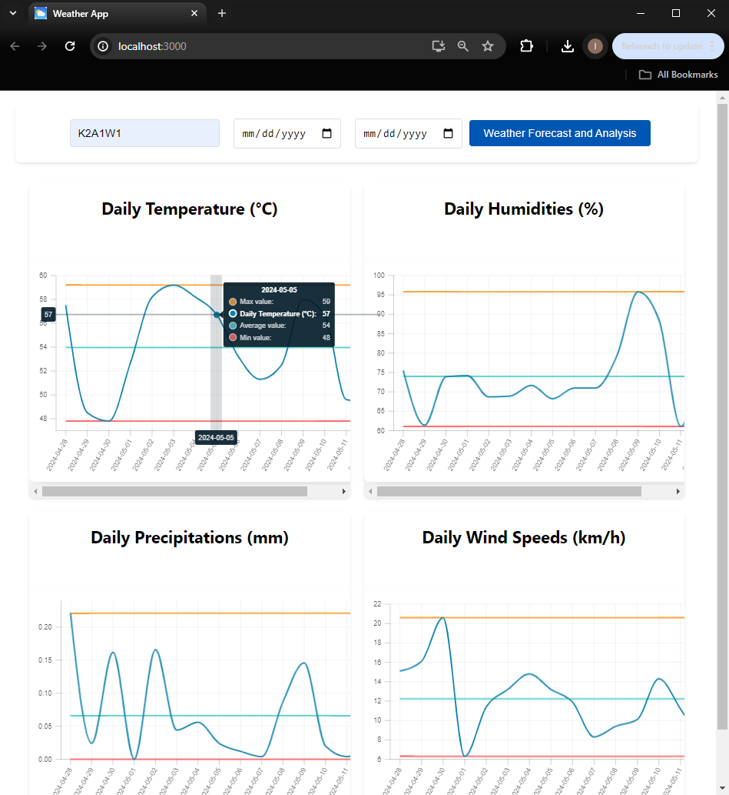
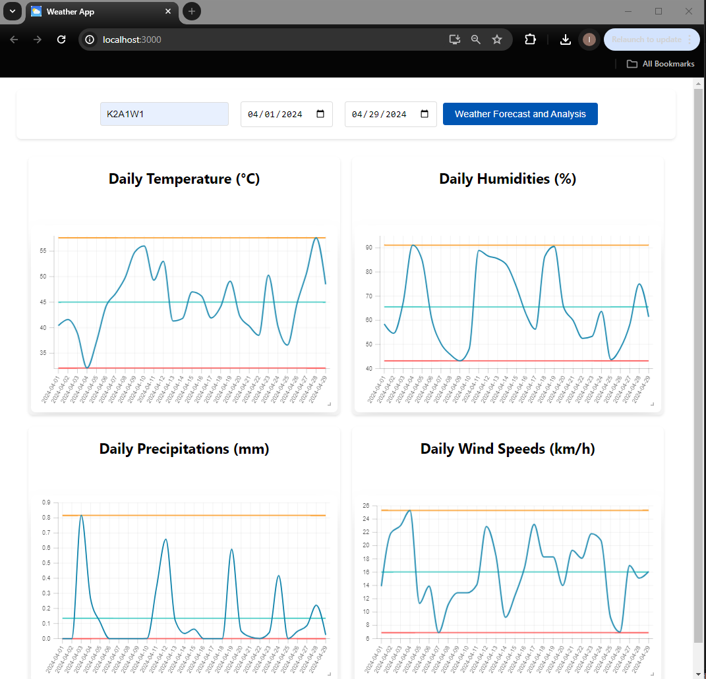

# Weather Analysis App with React: An application for Weather Analytics made by React

## Table of Contents
* [Introduction](#introduction)
* [Running App](#running-app)
* [Documentation](#documentation)
* [Contact](#contact)
* [License](#license)

## Introduction
The app analyze the weather data fetched from [Weather Data API](https://www.visualcrossing.com/weather-api).

## Running App
You can run the app by runnning `npm start` in the [weather_app_react] folder4.

## Documentation
* After running the app, if you just click [Weather Forecast and Analysis] without inputting any paramters, you can get  the forecast of next 15 days weather.

* If you click [Weather Forecast and Analysis] after inputting [Start Date] and [End Date], you can get the analysis data of the weather in that range.

## Contact
I hope to work with you. If you have any projects, you can contact me via Skype ID [live:.cid.b8144cf89d38b550]. I can help you in many areas including software development, web development and simulation. Thanks for your attention.

## License
[GNU GPL](LICENSE.txt)
